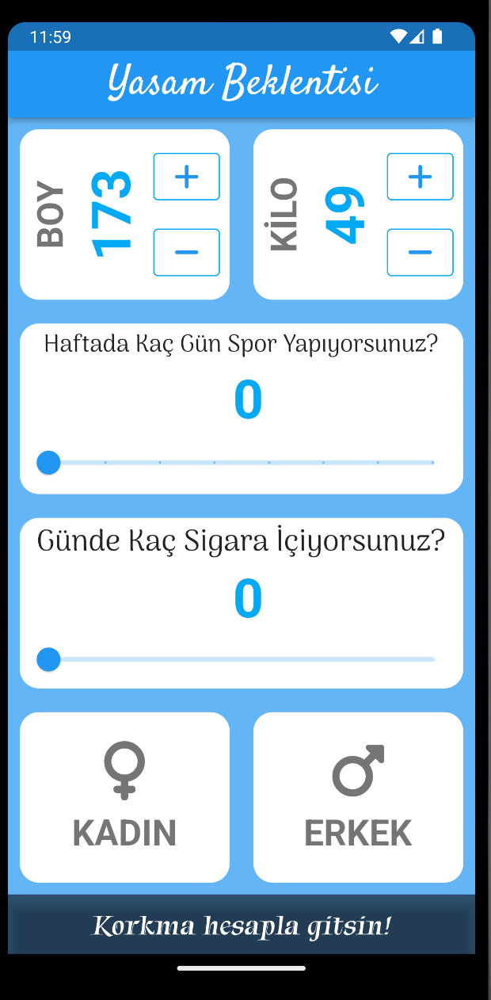
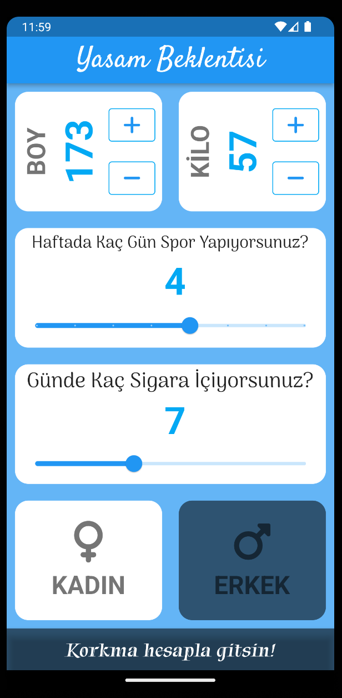
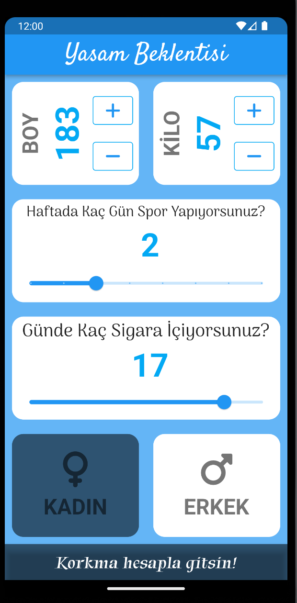

# live_expectancy

Yaşamımızda bazen acaba ne kadar ömrü kaldı? Bunun gündelik hayatta bazen kendi kendimize sorarız.
Gerçekte ne kadar kaldığını bilmek zor hatta imkansız fakat sağlık yaşam ile matematiksel olarak belki 
bir hesaplama ile ne kadar kalacağını hesaplayabilir böylelikle sağlık yaşama yaklaşımız artabilir.
Bu uygulamada sağlık yaşama biraz daha eğilim olması adına bazı temel bilgi ile hesaplama uygulaması yapılmıştır.
Bu bilgiler:
Boy,
Kilo,
Hafta kaç gün spor yapıyorsunuz?
Günde kaç sigara içiyorsunuz?
Cinsiyet

Bilgileri gir sonra hesapla gelsin!

 

